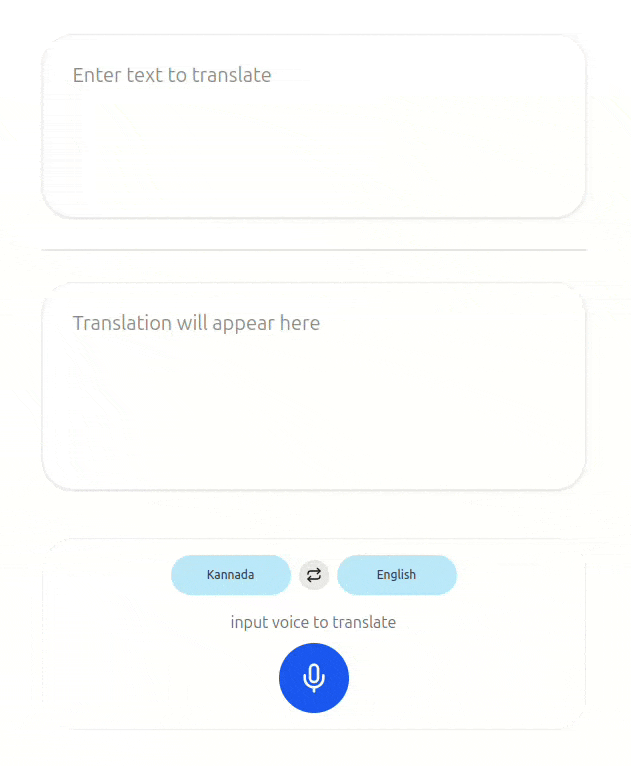

# GTranslate Clone

A clone of Google Translate using React, Node.js, FastAPI, and Google Cloud APIs.



## Roadmap

### Frontend

- [x] Implement basic UI with React without state management
  - Build out the UI components - Language Selector, Text Input, Text Output, and Buttons
- [x] Implement state management with Jotai
  - Implement state management for the language selection, swap, text input, and text output
- [x] Implement basic text translation with Google Cloud Translation API
- [x] Implement text-to-speech feature with Google Cloud Text-to-Speech API
  - Add panel action to play the translated text and copy to clipboard
- [x] Implement speech-to-text feature with Google Cloud Speech-to-Text API
  - Add Speech Input button to start recording and stop recording
- [x] Implement translation of speech-to-text with Google Cloud Translation API
- [x] Implement text-to-speech of translated speech-to-text with Google Cloud Text-to-Speech API
- [x] Deploy frontend to Cloudflare Pages
- [ ] Implement streaming speech input and output

### Backend

- [x] Implement basic API server with Node.js
  - Implement API endpoints for text translation, text-to-speech, and speech-to-text
- [x] Implement API server with FastAPI
  - Implement API endpoints for text translation, text-to-speech, and speech-to-text
- [x] Implement text translation with Google Cloud Translation API
- [x] Implement text-to-speech with Google Cloud Text-to-Speech API
- [x] Implement speech-to-text with Google Cloud Speech-to-Text API
- [x] Deploy API server to Google Cloud Run
- [ ] Implement streaming speech input and output

## Frontend

### Development

Set up an environment file `.env` with the following content:

```env
VITE_API_BASE_URL=gtranslate_backend_api_url
```

Run development server:

```bash
pnpm install
pnpm dev
```

### Deployment

Setup a Cloudflare Account and deploy to Cloudflare Pages with the following environment variable as a secret:

- `CF_API_BASE_URL`: Backend API URL

Deploy to Cloudflare Pages:

```bash
pnpm build
pnpm deploy
```

## Backend

### Submodules

[`gtranslate-node`](https://github.com/sreeharsha-rav/gtranslate-node) is a Node.js server to handle the backend API requests.

[`gtranslate-py`](https://github.com/sreeharsha-rav/gtranslate-py) is a FastAPI server to handle the backend API requests.

### Development

Set up an environment file `.env` with the following content:

```env
GOOGLE_PROJECT_ID=google_cloud_project_id
GOOGLE_APPLICATION_CREDENTIALS=google_cloud_credentials_service_account_key.json
```

### Deployment

Deploy to Cloud Run using docker file: https://cloud.google.com/run/docs/deploying

## License

This project is licensed under the MIT License - see the [LICENSE](LICENSE) file for details.
